# Integration Specialist Exercise

This project is a full stack implementation of a lead capture and analytics system built for the Integration Specialist assessment. It involves form creation, event tracking using Google Tag Manager and Analytics, API integration with Zapier and TalkFurther, Google Sheets fallback, and deduplication logic with email notifications.

---

 **Github Repo** -> https://github.com/knached99/talkfurthertakehome.git
 **Loom Recording** -> https://www.loom.com/share/1f4caf9d1c5f4cc0a7c43fa4fddc5bed


## Project Features

✅ A clean, Next.JS based web form styled with TailwindCSS to collect user data  
✅ Event tracking through Google Tag Manager and Google Analytics  
✅ API integration with TalkFurther via Zapier webhook  
✅ Validation logic for email and phone number in Zapier  
✅ Google Sheets fallback for invalid data  
✅ Deduplication logic with email alerts when a user resubmits  
✅ Nodemailer integration for email alerts using MailHog

---

## Tech Stack

- **Next.js 15.4.4 Using App Router**
- **Google Tag Manager** & **Google Analytics**
- **Zapier Webhook for ingestion**
- **TalkFurther API**
- **Google Sheets via Apps Script**
- **MailHog + Nodemailer** for local email notifications

---

## Cloning the Project

First of all, you will need the following installed on your local machine:
git, you can install it by visiting this link: https://git-scm.com/downloads

node version 22+
npm version 11+
mailhog, install it from this git repo: https://github.com/mailhog/MailHog

To install Mailhog for windows, simply visit this page: https://github.com/mailhog/MailHog/releases/v1.0.0

then scroll down and select either the MailHog_windows_386.exe OR MailHog_windows_amd64.exe

depending on your CPU (Intel or AMD respectively), see below screenshot:

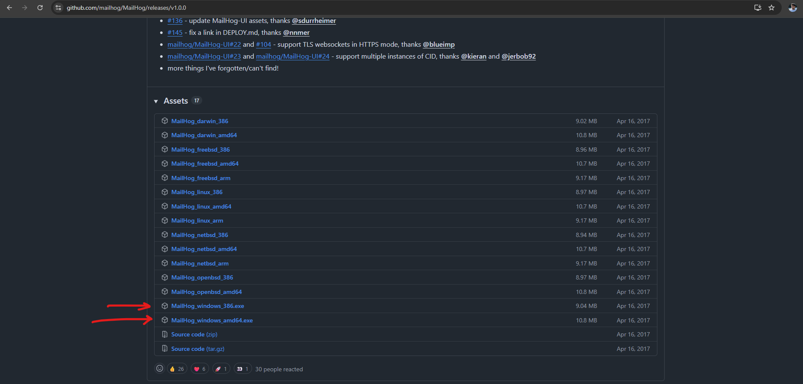

After installing the above, to confirm, run the following in your terminal:

1. ` node -v`
2. ` npm -v`
3. ` git -v`

```
git clone https://github.com/knached99/talkfurthertakehome.git
cd talkfurthertakehome
npm install
```

To run the app, run `npm run dev`

it will start the server on port 3000, access the page by visiting: http://localhost:3000/

Once you have installed mailhog if on Windows, rename the executable to mailhog 
and add the folder in which the executable is in to the PATH, then kill any existing Powershell session, 
re-open up Powershell and enter mailhog. It should start the mailhog server. Alternatively, you can search for "mailhog" in the Windows search at the bottom next to the Windows icon, and if you see  the mailhog run command, click that to start
 the mailhog server. 


 if you are on mac, use spotlight search and enter mailhog or run it from the terminal

then in your browser, visit http://localhost:8025

You can choose to enable notifications to see when the email comes into your inbox.

## Configuring Google Tag Manager (GTM) and Google Analytics (GA4)

You will also need to setup GTM and GA4 so the instructions to do so are here:

Follow the instructions here: https://support.google.com/tagmanager/answer/14842164?hl=en&ref_topic=15191151&sjid=9318567089703391649-NA from steps 1-4

Then set up a GTM trigger as a custom event, using the event name as the event attribute

Here are the instructions here: https://support.google.com/tagmanager/answer/7679316?hl=en

After that, setup Google Analytics using these instructions: https://support.google.com/analytics/answer/9304153?hl=en

Then use the measurementID from the Google Analytics property and paste it into the Tag you created in GTM

Here's how you can accomplish this:

1. Get the measurementID

2. Navigate to your Google Analytics 4 property

Go to Admin --> Data Streams and select your web data stream

3.  Copy the Measurement ID (it begins with "G-")

4.  Create a New Tag in GTM

Open your Google Tag Manager container

Click on Tags --> New, and give it a name

5. Configure the Tag:

Click Tag Configuration and choose Google Analytics: GA4 Configuration

Paste the copied GA4 Measurement ID into the Measurement ID field

Set the Trigger:

Click Triggering and select Initialization - All Pages (or a specific trigger) this ensures the GA4 configuration loads on all pages of the website

6.  Save and Publish:
    Click Save to create the tag
    Submit: your workspace in GTM to publish the changes to your live website

## Testing the form in debugview for GTM.

1. navigate to https://tagassistant.google.com

2. Click on "Add Domain" and enter http://localhost:3000

3) Click on "connect", it will establish a connection between your localhost server and GTM and will then open up a new tab. Submit the form while connected to GTM

If your Google Tag and Analytics are properly configured, you can view the data streaming in realtime.

## Usage and Task Breakdown

## Task 1 - Webform, GTM and Google Analytics

For task 1, I had to build out a responsive web form which collects the following information:

first name, last name, email, and phone number.

I also had to integrate GTM and Google Analytics (GA) to setup a custom trigger for form submission. I then had to setup a conversion goal in Google Analytics to track successful form submissions and display those events as conversions. The submission event is pushed to the
`dataLayer` and GTM picks it up and sends it to Google Analytics as a conversion

## Task 2 - sending the data to Zapier using TalkFurther API, and Google Sheets

On successful submission, the form makes 2 Zapier API calls,

first, a `GET` request is made to check if a lead within Zapier exists. It does this by sending off
the first name and phone number.

Secondly, if a lead does not exist, a `POST` request is sent to generate a new lead.

I used the following docs in Further to make those API requests:

1. Checking for a lead --> https://api-docs.talkfurther.com/#746b4bf4-a785-4b90-9a85-a3202b787e66

2. Generateing a new lead --> https://api-docs.talkfurther.com/#237f80c1-40d8-455b-8903-f312f0e50c34

Now if email AND phone number validation fail, that data is sent into Google Sheets

Google Sheets is connected to the form via the Apps Script:

```
https://script.google.com/macros/s/AKfycbx87mJclbp1j4tJJnBUpEFfo2W5lKv_UQx05KbrhDn8vooHYOeFMsKJ7puA5l4Tccmxfg/exec

```

## Task 3 - Deduplication and Email Notification

Task 3 asks to implement dedulication logic so that the same lead is not resubmitted into Zapier

first, the phone number is normalized so it is just digits, then it is checked against Zapier by making a GET request to the API with the Zapier webhook, if a duplicate is found, we send the email notification using MailHog via `nodemailer`

The email contains information about the lead (first and last name, email, and phone number)

This logic is used to prevent the creation of a new lead and ensures the team is notified about resubmissions

## Task 4 - Aesthetically Pleasing web app

This application is written in NextJS and styled with TailwindCSS. There are two reasons for this,

first being the UX and second being the DX. For the UX, the app must be intuitive and easy to use with minimal instructions to the user. It also must be aesthetically pleasing on all devices which is why TailwindCSS was used.

For DX, in case another developer wants to inspect the code or contribute, NextJS was used because it has huge community support
and also has a standard code practice that is widely followed. Everything is more structured rather than doing it in vanilla JS

### Screenshots

When you visit http://localhost:3000, you will be greeted with this form:

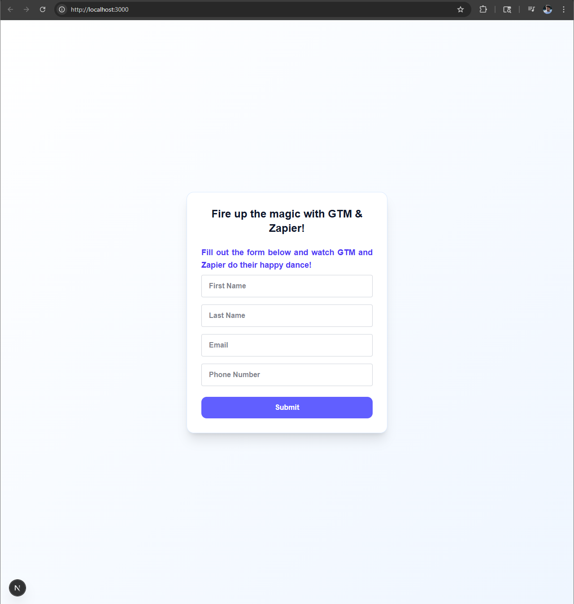

If you have errors, this is what the form will look like, prompting you to correct the highlighted fields:

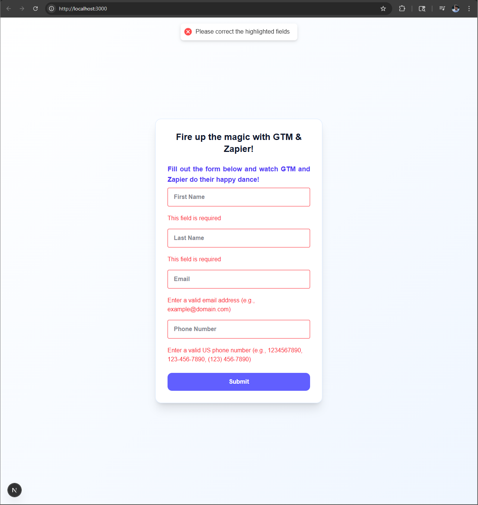

This is the message that will be shown if a lead exists in Zapier

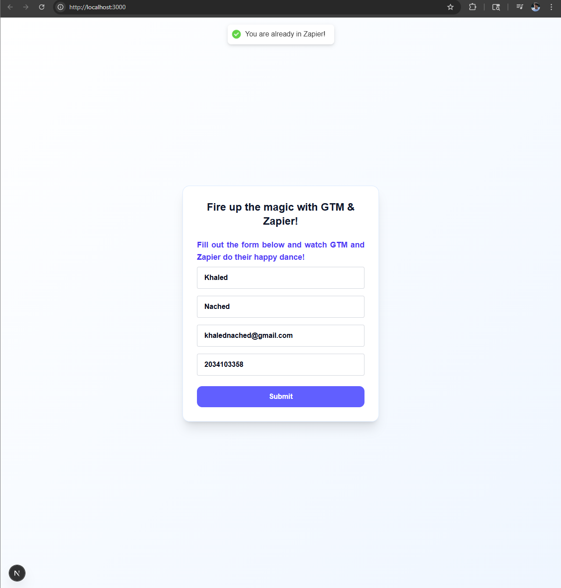

This message will be shown once a new lead is generated
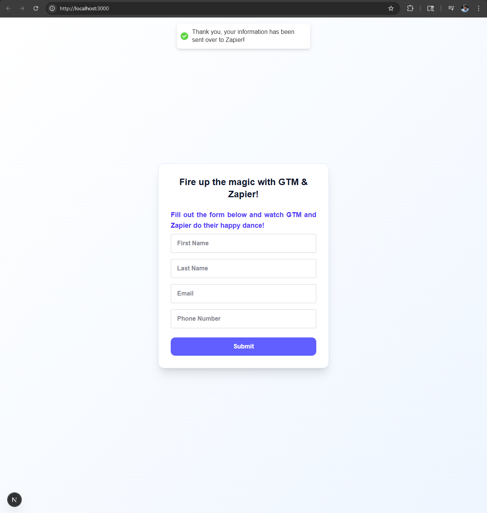

Using Postman to ensure that API calls were successful, you can see the newly generated lead here:

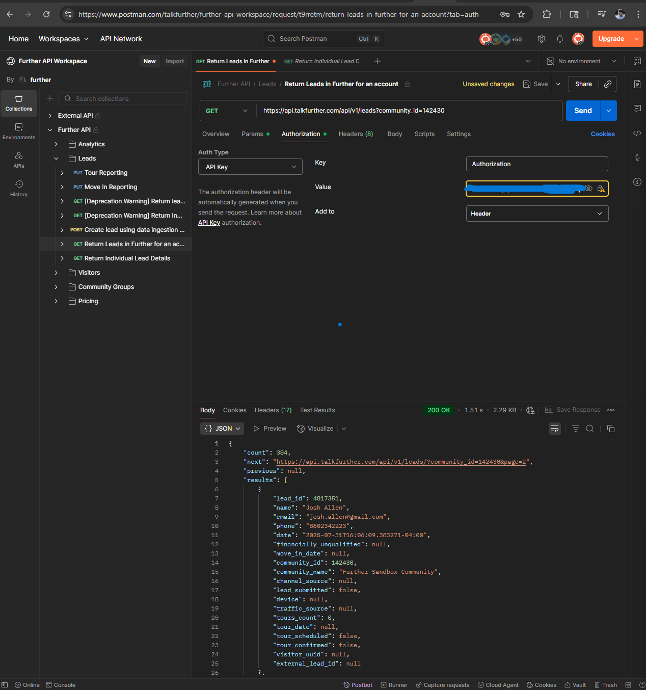

We use the tag assistant to connect to the http://localhost:3000/ URL to send the `lead_form_submitted` event

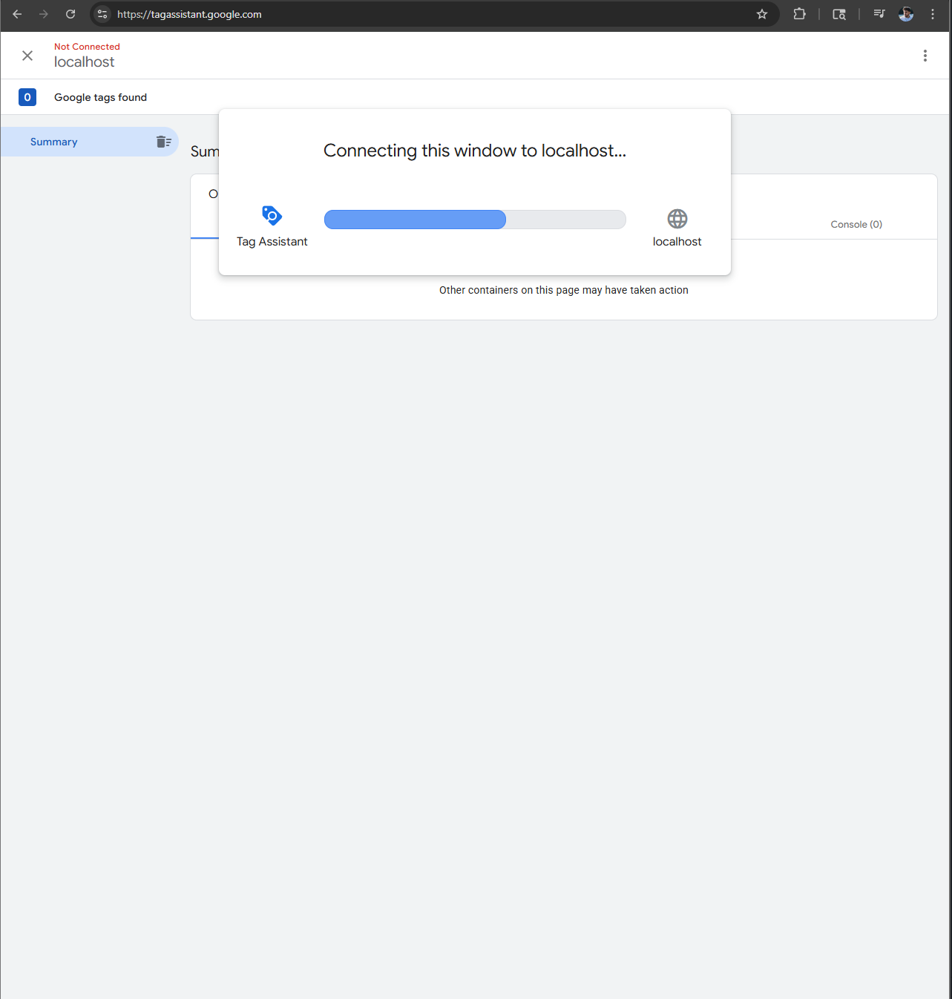

Next we open up the GTM debug page to collect the data after filling out the form, and send it to GTM. Note the bottom left where it says (1 issue), ignore that as that is because of the GTM. Everything will work as expected however.

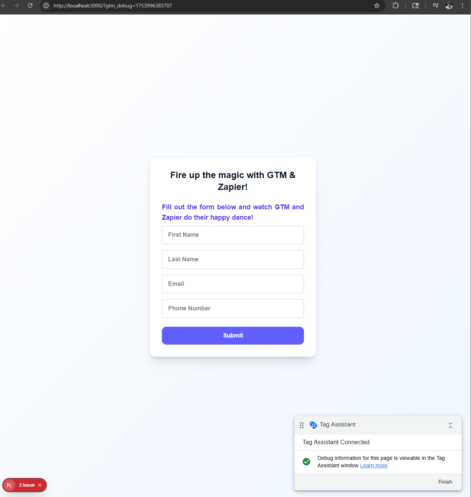

As you can see here, the data is sent to GTM after successful form validation

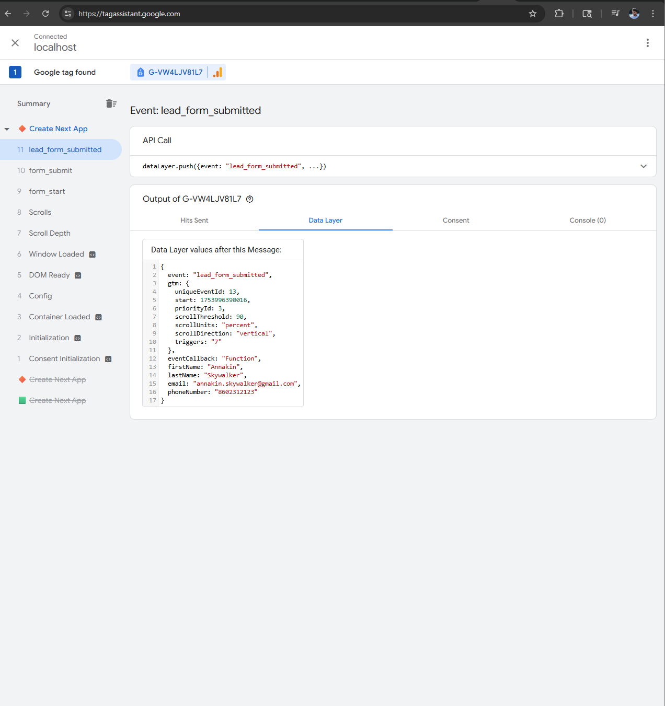

On invalid email AND phone number validation, data is inserted into Gooelsheets as you can see here:

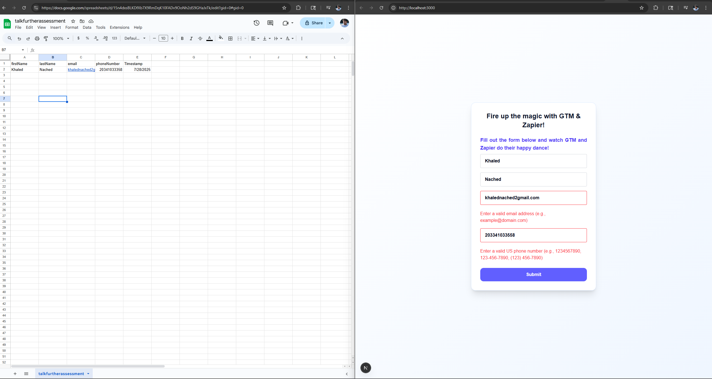

Custom Event Definitions in Google Analytics
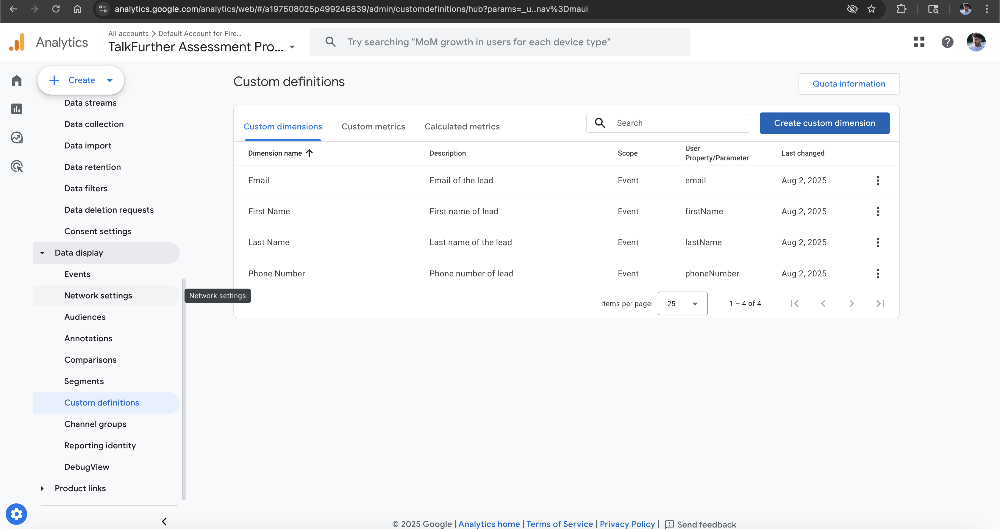

Google analytics Events Report

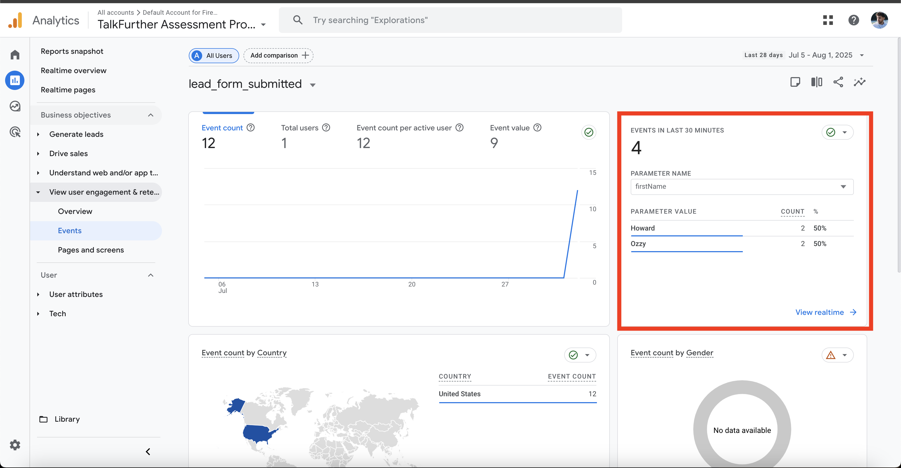

Google analytics events data stream
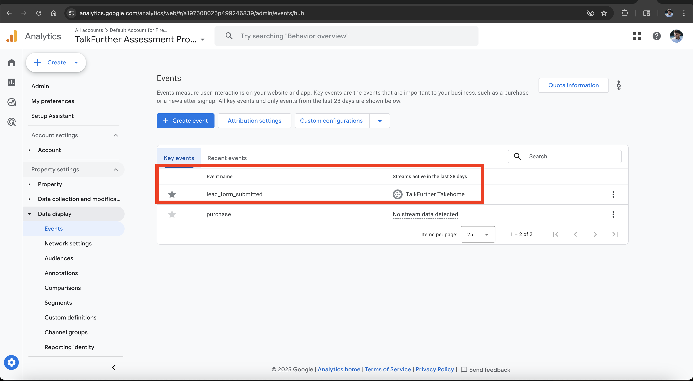
