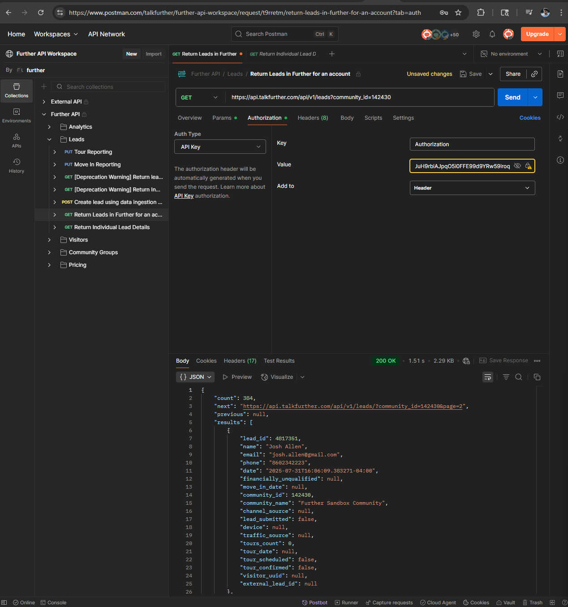

# Integration Specialist Exercise

This project is a full stack implementation of a lead capture and analytics system built for the Integration Specialist assessment. It involves form creation, event tracking using Google Tag Manager and Analytics, API integration with Zapier and TalkFurther, Google Sheets fallback, and deduplication logic with email notifications.

---

## Project Features

✅ A clean, Next.JS based web form styled with TailwindCSS to collect user data  
✅ Event tracking through Google Tag Manager and Google Analytics  
✅ API integration with TalkFurther via Zapier webhook  
✅ Validation logic for email and phone number in Zapier  
✅ Google Sheets fallback for invalid data  
✅ Deduplication logic with email alerts when a user resubmits  
✅ Nodemailer integration for email alerts using MailHog  

---

## 🛠 Tech Stack

- **Next.js 15.4.4 Using App Router**
- **Google Tag Manager** & **Google Analytics**
- **Zapier Webhook for ingestion**
- **TalkFurther API**
- **Google Sheets via Apps Script**
- **MailHog + Nodemailer** for local email notifications

---

## Cloning the Project

First of all, you will need the following installed on your local machine: 
git, you can install it by visiting this link: https://git-scm.com/downloads

node version 22+
npm version 11+
mailhog, install it from this git repo: https://github.com/mailhog/MailHog

After installing the above, to confirm, run the following in your terminal:

1) ``` node -v```
2) ``` npm -v```
3) ``` git -v```

```
git clone https://github.com/knached99/talkfurthertakehome.git
cd talkfurthertakehome
npm install
``` 

To run the app, run ``` npm run dev ```

it will start the server on port 3000, access the page by visiting: http://localhost:3000/

Once you have installed mailhog, if you are on mac, use spotlight search and enter mailhog, if on Windows, enter mailhog in the search next to the Windows icon to open up mailhog. 

then in your browser, visit http://localhost:8025 

You can choose to enable notifications to see when the email comes into your inbox 

## Usage and Task Breakdown 

## Task 1 Webform, GTM and Google Analytics 

For task 1, I had to build out a responsive web form which collects the following information:

first name, last name, email, and phone number. 

I also had to integrate GTM and Google Analytics (GA) to setup a custom trigger for form submission. I then had to setup a conversion goal in Google Analytics to track successful form submissions and display those events as conversions. The submission event is pushed to the
```dataLayer``` and GTM picks it up and sends it to Google Analytics as a conversion 

## Task 2 - sending the data to Zapier using TalkFurther API, and Google Sheets

On successful submission, the form makes 2 Zapier API calls,

first, a ```GET``` request is made to check if a lead within Zapier exists. It does this by sending off
the first name and phone number. 

Secondly, if a lead does not exist, a ``` POST ``` request is sent to generate a new lead.

I used the following docs in Further to make those API requests:

1) Checking for a lead --> https://api-docs.talkfurther.com/#746b4bf4-a785-4b90-9a85-a3202b787e66

2) Generateing a new lead --> https://api-docs.talkfurther.com/#237f80c1-40d8-455b-8903-f312f0e50c34


Now if email OR phone number validation fail, that data is sent into Google Sheets

Google Sheets is connected to the form via the Apps Script:

``` 
https://script.google.com/macros/s/AKfycbx87mJclbp1j4tJJnBUpEFfo2W5lKv_UQx05KbrhDn8vooHYOeFMsKJ7puA5l4Tccmxfg/exec

```

## Task 3 Deduplication and Email Notification 

Task 3 asks to implement dedulication logic so that the same lead is not resubmitted into Zapier 

first, the phone number is normalized so it is just digits, then it is checked against Zapier by making a GET request to the API with the Zapier webhook, if a duplicate is found, we send the email notification using MailHog via ```nodemailer``` 

The email contains information about the lead (first and last name, email, and phone number)

This logic is used to prevent the creation of a new lead and ensures the team is notified about resubmissions

### Screenshots 

When you visit http://localhost:3000, you will be greeted with this form:


If you have errors, this is what the form will look like, prompting you to correct the highlighted fields:


This is the message that will be shown if a lead exists in Zapier 


This message will be shown once a new lead is generated


Using Postman to ensure that API calls were successful, you can see the newly generated lead here:



On invalid email or phone number validation, data is inserted into Gooelsheets as you can see here:

